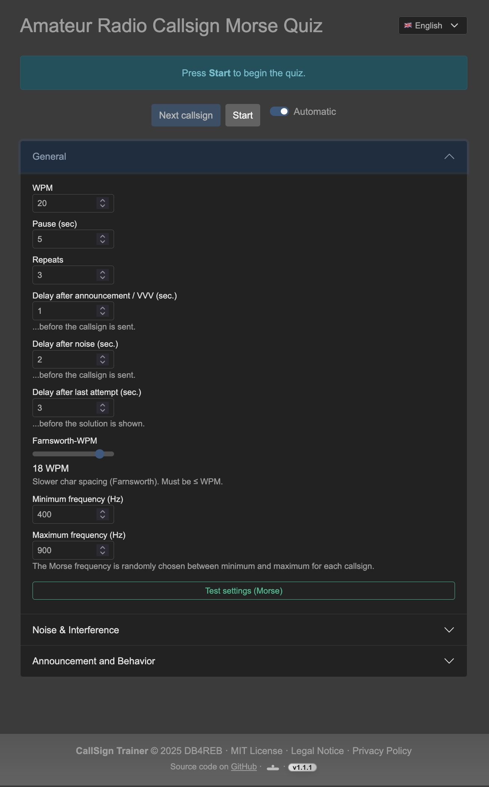

# CallSignTrainer

CallSignTrainer is a web application for practicing and training amateur radio call signs in Morse code (CW).

## Features

- Random selection and playback of amateur radio call signs as Morse code (CW)
- Adjustable speed (WPM), pause duration, repetitions, noise level, and QSB simulation
- Speech output for hints and solutions (Text-to-Speech)
- Two languages: German and English
- Supports desktop and mobile browsers (including Firefox, Safari, Chrome)
- Automatic and manual mode

## Usage

1. **Start**: Click "Start" to begin the training.
2. **Settings**: Adjust speed, pause, repetitions, noise, and QSB as desired.
3. **Pause/Resume**: You can pause and resume the training at any time.
4. **Language**: Select German or English.

## Notes

- On mobile devices, you may need to activate sound by clicking a button.
- On iOS devices, make sure the mute switch is off, otherwise Morse noise will be muted.

## Installation

1. Clone or download the repository.
2. Open in your browser (e.g., via a local web server like MAMP/XAMPP or upload directly to a web server).
3. The application is ready to use.

## Screenshots

### Main Screen

### New Round

### End of Round

## Third Party / Credits

This project uses [Bootswatch](https://bootswatch.com/) themes, which are released under the MIT License:

> Bootswatch (c) Thomas Park  
> https://github.com/thomaspark/bootswatch  
> Licensed under the MIT License

Theme CSS files in `css/themes/` are based on Bootswatch.

---

## License

MIT License

---

Enjoy training!