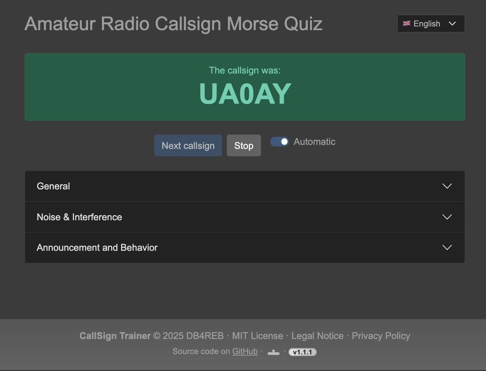
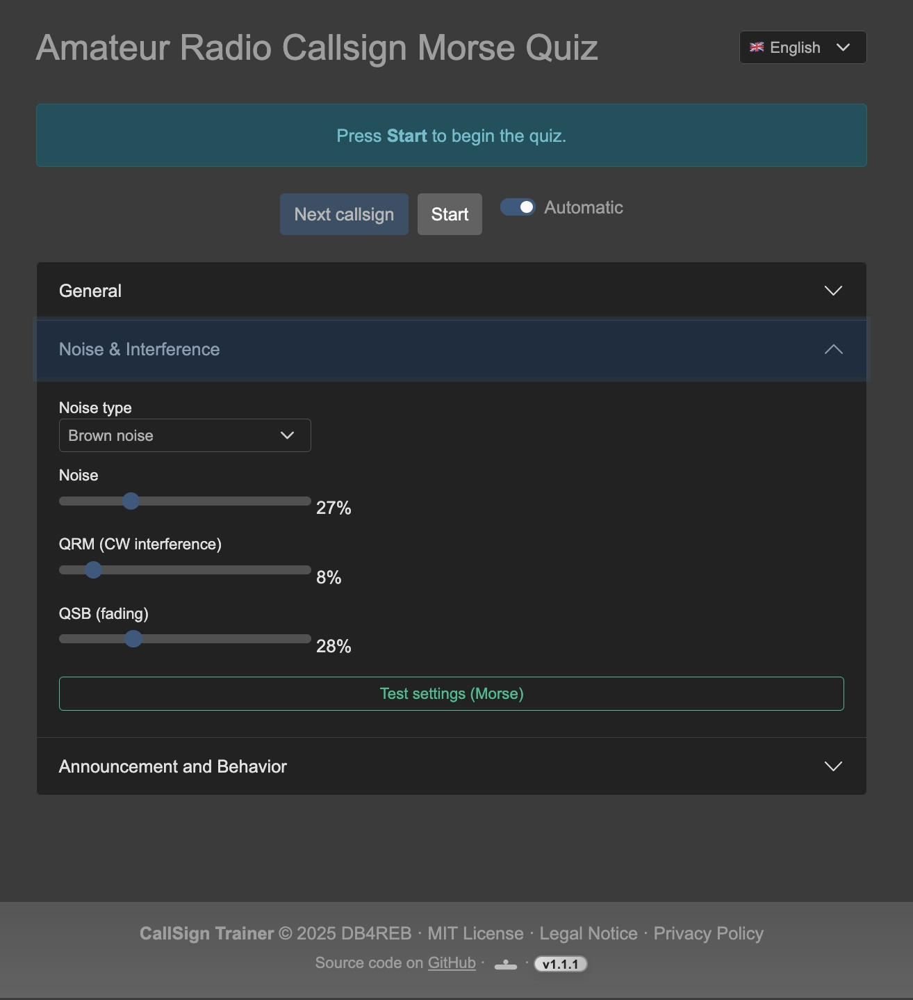
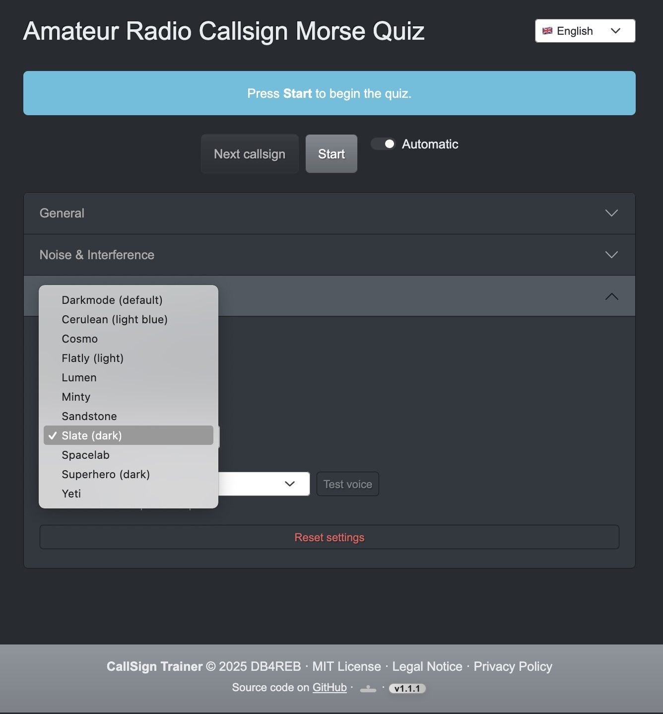
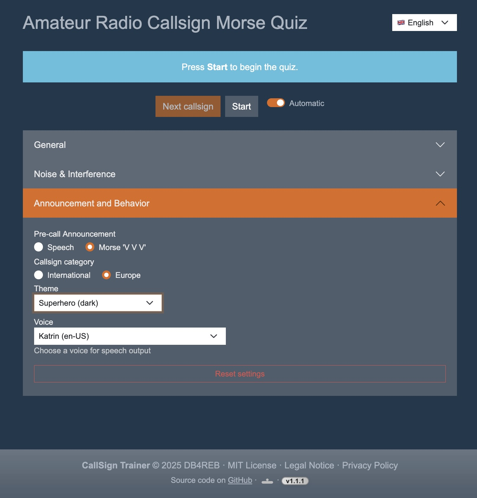

# CallSignTrainer

CallSignTrainer is a web application for practicing and training amateur radio call signs in Morse code (CW).

## Features

- Random selection and playback of amateur radio call signs as Morse code (CW)
- Adjustable speed (WPM), pause duration, repetitions
- **Farnsworth spacing**: Adjustable character and word spacing for effective learning
- Adjustable noise level and simulation of different noise types (**white, pink, brown noise, QRN**)
- **QSB (fading) and QRM (interference) simulation** for realistic practice
- Speech output for hints and solutions (Text-to-Speech)
- German and English language UI
- Selectable color themes (including Darkmode and various Bootswatch themes)
- Supports desktop and mobile browsers (including Firefox, Safari, Chrome)
- Automatic and manual mode

## Usage

1. **Start**: Click "Start" to begin the training.
2. **Settings**: Adjust speed, pause, repetitions, noise, and QSB as desired.
3. **Stop/Start**: You can Stop and Start the training at any time.
4. **Language**: Select German or English.

## Notes

- On mobile devices, you may need to activate sound by clicking a button.
- On iOS devices, make sure the mute switch is off, otherwise Morse noise will be muted.

## Installation

### Option 1: Using a Local Web Server (e.g. MAMP/XAMPP)

1. Clone or download the repository.
2. Place the files in your local web server directory (e.g., `htdocs` for MAMP).
3. Open `index.html` in your browser via your local server (e.g., http://localhost/CallSignTrainer/).
4. The application is ready to use.

### Option 2: Using npm and a Static Server

1. Make sure you have [Node.js](https://nodejs.org/) and npm installed.
2. Clone or download the repository.
3. Open a terminal in the project folder.
4. Install dependencies:
    ```bash
    npm install
    ```
5. Start the local server (choose one):
    - For [http-server](https://www.npmjs.com/package/http-server):
      ```bash
      npm run start
      ```
    - For [live-server](https://www.npmjs.com/package/live-server) with auto-reload:
      ```bash
      npm run live
      ```
6. Open [http://localhost:8080/](http://localhost:8080/) in your browser.

---

## Screenshots

### Main Screen


### New Round


### End of Round


### Noise Settings


### Change Theme


### Announcement and Behavior


### Change Voice


---

## Third Party / Credits

This project uses [Bootswatch](https://bootswatch.com/) themes, which are released under the MIT License:

> Bootswatch (c) Thomas Park  
> https://github.com/thomaspark/bootswatch  
> Licensed under the MIT License

Theme CSS files in `css/themes/` are based on Bootswatch.

---

## License

MIT License

---

Enjoy!